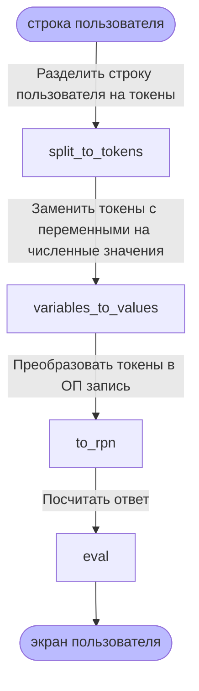

# Калькулятор команды "Леша бросает курить"

## 📋 Описание

Это калькулятор, сделанный для проектов по курсу "Программирование на C" в ВШЭ.
Калькулятор принимает математическое выражение в инфиксной записи, вычисляет
ответ и выводит его на экран.

Плюшки:

 * поддерживает переменные
 * оттестирован до нитки
 * написан с любовью ❤️

## 🏗 Компиляция

```sh
make
```

## 🧪 Тестирование

```sh
make test
```

## 🧑‍🏭 Принцип работы



## 🧑‍🎓 Чему научились

Мы хотели написать проект не только для того, чтобы улучшить понимание C, а для
того, чтобы потрогать хорошие практики программирования. Может показаться
абсурдным использование сложных технологий для такой простой задачи, но в их
изучении и была главная цель.

Мы

 * писали код в git-репозитории укротили Github Actions и Docker для
 автоматической компиляции и проверки качества кода
 * изучили библиотеку greatest для написания юнит-тестов использовали Kanban
 * доску и Pull Requests для управлениями задачами

Итогом мы получили проект, в котором автоматически прогонялась компиляция,
проверялся стиль кода.  Каждое новое изменение проверялось не только автором
кода, но 1 &ndash; 2 ревьюверами. Таким образом, внутри команды поддерживалось
общее понимание внутренностей проекта, баги отлавливались до вливания в
основную кодовую базу, а более сообразительные участники делились знаниями с
остальными.

## 📺 Дополнительная активность

Мы даже устроили онлайн-трансляции для нашего потока!

Каждую субботу Оскар подключался и 2 &ndash; 3 часа транслировал, как он
программирует или настраивает окружение. Суммарно на данный момент стримы
набрали более 280 просмотров, и это не конец.
